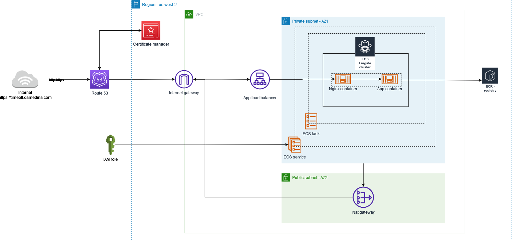

# Timeoff-app - DevOps improvements

Devops improvements made for gorilla's technical test


## Features

- New folder structure
- Nginx server
- Terraform scripts
- GitHub actions (CI-CD)


## Demo

- [timeoff-app](https://timeoff.damedina.com/login/) (The app will be available one week, cost reasons :P )


## Tech Stack

****APP****
- **Client:** React, Redux, TailwindCSS
- **Server:** Node, Express

****DEVOPS****
- **CI-CD:** Github Actions
- **IaC:** Terraform
- **Reverse proxy:** Nginx
- **Cloud:** AWS (VPC - ALB - ECR - ECS - Route 53 - ACM - IAM)


## Documentation

| Plugin | README |
| ------ | ------ |
| Timeoff-app | [timeoff-app/readme.md](https://github.com/DavidArangoM/timeoff-management-application/tree/master/timeoff-app) |
| GitHub actions | [.github/workflows/readme.md](https://github.com/DavidArangoM/timeoff-management-application/tree/master/.github/workflows)|
| Nginx | [nginx/readme.md](https://github.com/DavidArangoM/timeoff-management-application/tree/master/nginx) |
| Terraform | [terraform/readme.md](https://github.com/DavidArangoM/timeoff-management-application/tree/master/terraform) |

## Architecture




## Run Locally

Clone the project

```bash
  git clone https://github.com/DavidArangoM/timeoff-management-application
```

Go to the project directory

```bash
  cd timeoff-app
```

Install dependencies

```bash
  npm install
```

Start the server

```bash
  npm run start
```

## Authors

- [@David Arango Medina](https://github.com/DavidArangoM)